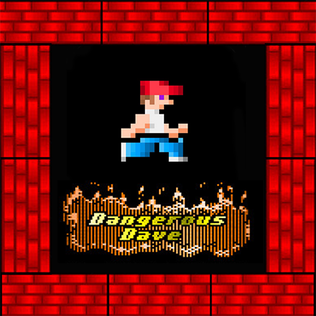

# Deadly Dave JS (Browser Port)

This repository contains a TypeScript browser port of **Deadly Dave** (originally **Dangerous Dave** created by [John Romero](https://en.wikipedia.org/wiki/John_Romero)).

## Origin

This project is a port of the C codebase originally published at:
`https://github.com/skoperst/deadly-dave`

## Why this port exists

The goal was to make the game easy to run in a modern browser while preserving the original gameplay feel.

## Personal note

This is a nostalgia-inspired project. [Dangerous Dave](https://en.wikipedia.org/wiki/Dangerous_Dave) was the first game I played when I was 8 years old on a Soviet **[Poisk-1](https://en.wikipedia.org/wiki/Poisk_(computer)** computer, and I wanted to port it so I could play it again directly in the browser.

## Local development

```bash
npm install
npm run web:dev
```

Then open:

`http://localhost:4173`

## Tests

```bash
npm test
```

## Audio assets

Sound effects are generated from local symbol data in `scripts/sfx-symbols.json`:

```bash
npm run audio:build
```
